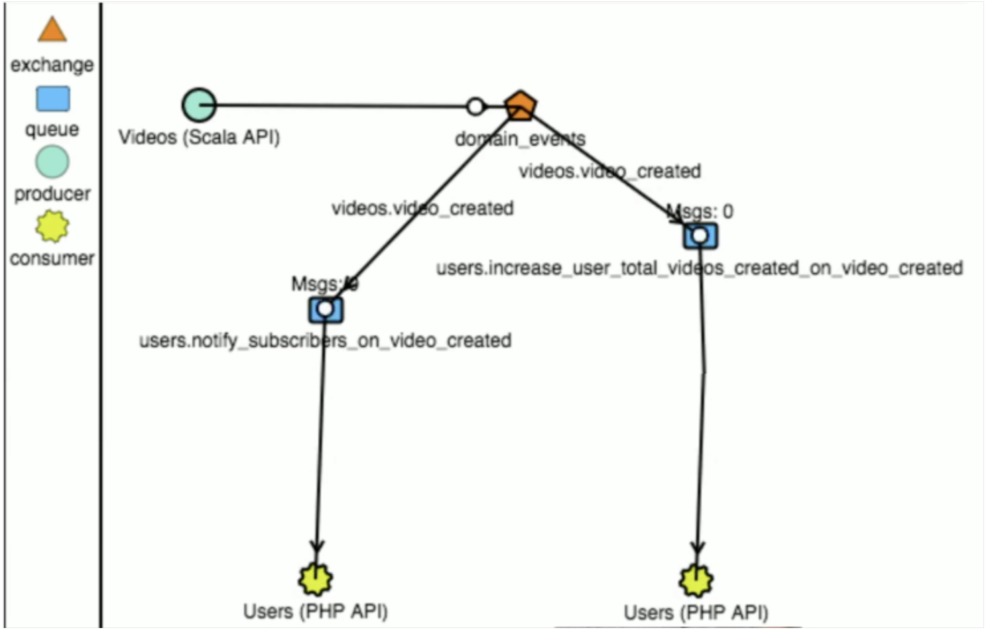
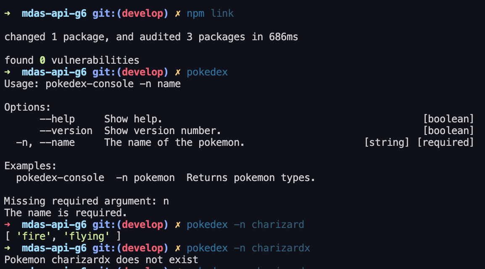
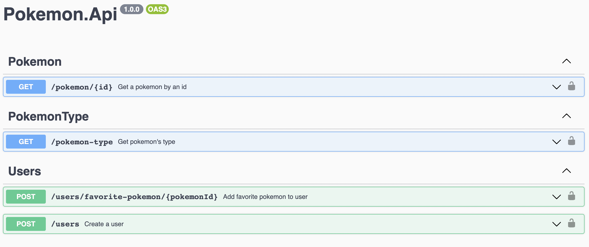

# LaSalle - Diseño del software II 

# 🎯 Pokedex Challenges

# 1.1 Pokemon Types

### Requirements:

* API: https://pokeapi.co
* Given the name of the pokemon return the type by:
  * Console - Terminal
  * Via Endpoint Http Body Json
* Control exceptions (Pokemon not found, PokeApi is down).
* The input via argument has to continue to work even if the api is down.

# 1.2 Favorite Pokemon

### Requirements:

* Create user
* Given the id of the pokemon add to the user's favorite list and save in memory:
  * Via Endpoint Http Body Json
* Control exceptions (User not found, UserAlreadyExists, PokemonAlreadyFavorite, PokeApi is down).

# 1.3 Domain Events
### Requirements:

* Setup Rabbit MQ
* Increment times pokemon has been marked as favorite pokemon by any user through domain events
* Add a extra property favorite counter total in pokemon aggregate

###  Approach: 

###  📤  Level Publisher
1 exchange by [micro]service

* Exchange Topic: Allows us to filter by type of event (including wildcards)
###  📤  Level Consumer
1 queue per consumer and event use case

* Cost optimization by consuming only the type of event that interests us (we do not need to apply filters)
* Do not 'steal' events
* Possibility of re-queuing events for having failed in a specific use case

# 2. 🚀 Environment Setup

### 🐳 Needed tools

1. [Install Docker](https://www.docker.com/get-started)
2. [Install NodeJS (Required by CLI pokedex)](https://nodejs.org/es/download/)
2. Clone this project: `https://github.com/kevensaldana/mdas-api-keven_saldana.git`
3. Move to the project folder: `cd mdas-api-keven_saldana`
4. npm install

# 3. 🚀 Apps

### 🔥 CLI Pokedex

1. docker-compose up --build
2. npm link
3. Now we can execute the pokedex cli

### 🔥 API Pokedex
1. docker-compose up --build
2. Go to: http://localhost:5001/docs

# 4. 🚀 Tests

### ✅ Acceptance, Integration and Unit Testing
1. npm run test (for Mac and Linux)
2. npm run test:win (for Windows)
